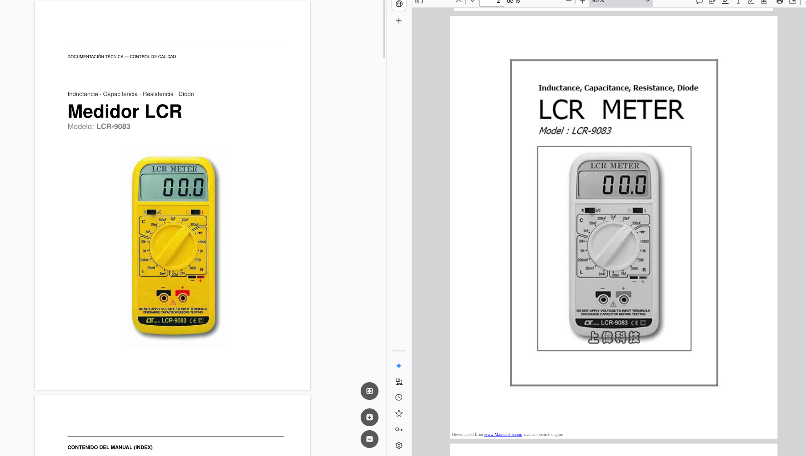
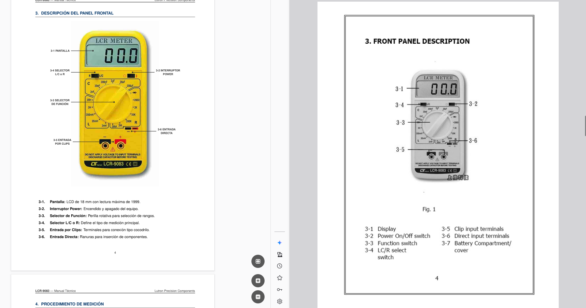
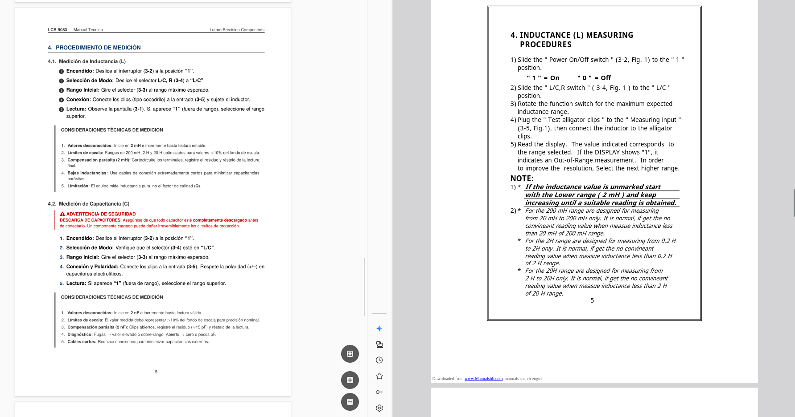

# Instrumentation Manuals Pro 🛠️

**Optimización y localización técnica de manuales industriales.**

[](https://www.latex-project.org/)
[](https://www.heretto.com/blog/what-is-technical-writing)
[](https://wdo.org/about/definition/)
[](https://opensource.org/licenses/MIT)

---

Este repositorio contiene muestras de rediseño, traducción y optimización de documentación técnica para instrumentos de medición (especialidad en **Lutron**), utilizando **LaTeX** para garantizar una precisión editorial de grado industrial y tipografía impecable.

---

## 📸 Vista Previa (Showcase)

### Proyecto Destacado: Lutron LCR-9083

A continuación, se muestran las diferentes secciones del manual rediseñado:

|                       Portada Profesional                        |                       Diagramas con TikZ                       |                         Procedimientos Técnicos                         |
| :--------------------------------------------------------------: | :------------------------------------------------------------: | :---------------------------------------------------------------------: |
|  |  |  |

---

## 🚀 Características del Proyecto

- **Rediseño Editorial:** Conversión de manuales escaneados a PDFs vectoriales de alta calidad (12pt, Helvetica).
- **Localización Técnica:** Traducción técnica precisa (Inglés - Español) para el mercado industrial.
- **Gráficos Vectoriales:** Esquemas del panel frontal realizados con **TikZ/PGF** para evitar pixelación.
- **Automatización:** Sistema de compilación basado en `Makefile` para gestión profesional de proyectos.

## 📁 Estructura del Repositorio

- `projects/`: Contiene los manuales organizados por modelo.
  - `imgs/`: Capturas y recursos gráficos del proyecto.
  - `original/`: Documento base de fábrica para comparación.
  - `src/`: Código fuente en LaTeX (`.tex`).

## 🛠️ Cómo compilar

Si tienes un entorno LaTeX instalado (como TeX Live), puedes generar los manuales con un solo comando:

```bash
# Compilar todo el portafolio
make

# Compilar un modelo específico
make lutron-8007fe

# Limpiar archivos temporales (.log, .aux, .out, etc.)
make clean

```

## 📄 Comparativa de Calidad (Samples)

Haz clic en los enlaces para comparar la evolución del documento directamente en el repositorio:

- **Lutron LCR-9083 (Ref. 8007fe):** - [📄 Manual de Fábrica (Original)](./projects/lutron-8007fe/original/8007fe.pdf)
  - [🚀 Rediseño Pro (LaTeX)](./projects/lutron-8007fe/src/plantilla_lutron.pdf)

---

## 📩 Contacto / Hire Me

¿Necesitas optimizar la documentación técnica de tu empresa o digitalizar manuales antiguos?

- **Especialidad:** Electrónica, instrumentación industrial y control de calidad.
- **Servicios:** Rediseño en LaTeX, esquemas vectoriales (TikZ) y localización técnica.
- **Portafolio Web:** [Portafolio](https://marcosbernardc.github.io/PortafolioBernardC/#)

---

<p align="center">
  <b>Manuales optimizados para Portafolios de Ingeniería y Control de Calidad</b>
</p>
